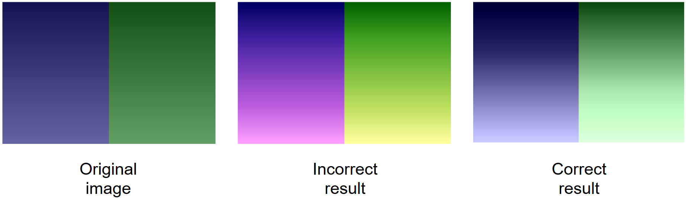

# 🌈 Equalização de Histograma

## 🎯 Objetivo

Aplicar a técnica de equalização de histograma de maneira apropriada em imagens coloridas.

---

## 🧪 Tarefa

Implemente a função:

```python
def equalize_histogram(image_path: str) -> np.ndarray:
```

---

## 📷 Imagem de Teste

Use a imagem `unequal_lighting_color_image.png` (inclusa neste repositório), com iluminação desigual e contraste reduzido.

---

## 🚫 Restrições

- Você pode usar as bibliotecas `cv2` (OpenCV) e `numpy`.
- A função deve retornar uma imagem no formato RGB (np.ndarray).

---

## ✅ Testes

Execute:

```bash
python test_histogram_equalization.py
```

## Exemplo



---

